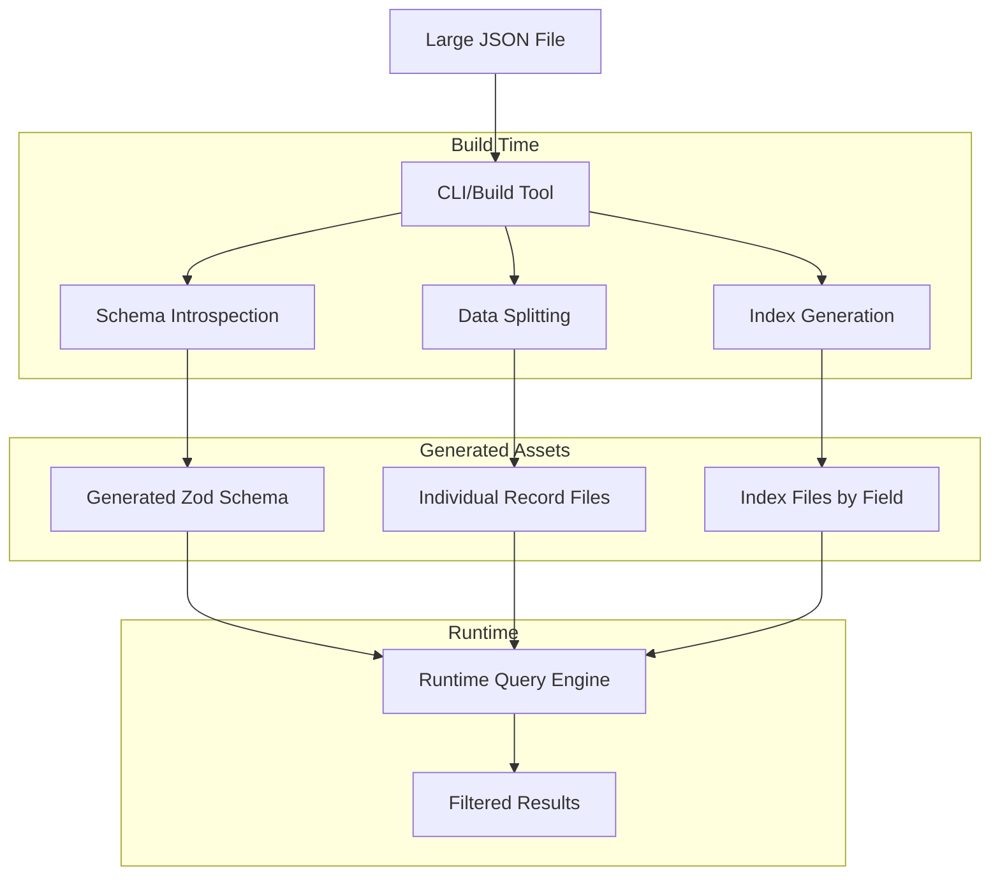

# Rules

- use pnpm
- use inbuilt node test framework.
- after modifying existing code, check if thaht feature is mentioned in the readme.md and if you need to update the existing documentation.
- the package is made for browser usage.

Perfect! Now I have a clear understanding of your vision. Let me create a comprehensive plan for building this static file database library.

# Project Plan: Antipattern-DB - Static File Database

## Overview

A TypeScript library that converts large JSON files into a queryable, static file database optimized for static hosting environments like GitHub Pages and Vercel. The library will split data into individual files with an intelligent indexing system and provide type-safe querying capabilities.

## Architecture Design



## Core Components

### 1. **Builder Module** (`src/builder/`)

- **Schema Introspector**: Analyzes JSON data to generate Zod schemas
- **Data Splitter**: Splits large JSON into individual record files
- **Index Generator**: Creates efficient indexes for queryable fields
- **File Optimizer**: Optimizes file structure for static hosting

### 2. **CLI Module** (`src/cli/`)

- Command-line interface for build operations
- Configuration file support
- Progress reporting and validation

### 3. **Runtime Query Engine** (`src/runtime/`)

- **Database Client**: Main interface for querying data
- **Index Reader**: Efficient index file loading and caching
- **Query Parser**: Handles filtering, sorting, and pagination
- **Type Safety**: Integration with generated Zod schemas

### 4. **Types Module** (`src/types/`)

- Core TypeScript interfaces and types
- Query builder types
- Configuration types

## Detailed Implementation Plan

### Phase 1: Core Builder Infrastructure

1. **Schema Introspection Engine**
   - Analyze JSON structure recursively
   - Generate Zod schemas with proper typing
   - Handle nested objects and arrays
   - Support for optional fields and unions

2. **Data Splitting Strategy**
   - Split records into individual JSON files
   - Implement consistent naming convention
   - Handle large arrays and nested structures
   - Optimize file sizes for HTTP requests

3. **Index Generation System**
   - Create indexes for all queryable fields
   - Support for primitive types, arrays, and nested objects
   - Generate efficient lookup tables
   - Create metadata files for query optimization

### Phase 2: CLI Implementation

1. **Command Structure**

   ```bash
   antipattern-db build <input.json> <output-dir> [options]
   antipattern-db validate <output-dir>
   antipattern-db info <output-dir>
   ```

2. **Configuration Support**
   - [`antipattern.config.ts`](antipattern.config.ts) file support
   - Custom field indexing rules
   - Output optimization settings
   - Schema generation options

### Phase 3: Runtime Query Engine

1. **Database Client API**

   ```typescript
   const db = new AntipatternDB('/path/to/generated/db');

   // Simple queries
   const user = await db.get('users', '123');
   const users = await db.find('users', { status: 'active' });

   // Advanced queries
   const results = await db
     .query('users')
     .where('age', '>', 25)
     .where('status', 'active')
     .sort('name')
     .limit(10)
     .exec();
   ```

2. **Query Optimization**
   - Intelligent index selection
   - Lazy loading of data files
   - Caching strategies for repeated queries
   - Batch loading for multiple records

### Phase 4: Advanced Features

1. **Performance Optimizations**
   - Compression support for generated files
   - Progressive loading strategies
   - Memory-efficient data structures
   - Browser-specific optimizations

2. **Developer Experience**
   - TypeScript intellisense support
   - Comprehensive error messages
   - Development mode with detailed logging
   - Integration with popular frameworks

## File Structure

```
antipattern-db/
├── src/
│   ├── builder/
│   │   ├── schema-introspector.ts
│   │   ├── data-splitter.ts
│   │   ├── index-generator.ts
│   │   └── file-optimizer.ts
│   ├── cli/
│   │   ├── commands/
│   │   ├── config.ts
│   │   └── index.ts
│   ├── runtime/
│   │   ├── database-client.ts
│   │   ├── query-engine.ts
│   │   ├── index-reader.ts
│   │   └── cache.ts
│   ├── types/
│   │   ├── builder.ts
│   │   ├── runtime.ts
│   │   └── config.ts
│   └── index.ts
├── tests/
├── examples/
└── docs/
```

## Technical Specifications

### Dependencies

- **Zod**: Schema validation and type generation
- **Commander.js**: CLI framework
- **Node.js fs/promises**: File system operations
- **TypeScript**: Type safety and compilation

### Generated Database Structure

```
output-dir/
├── schema.json          # Generated Zod schema
├── metadata.json        # Database metadata
├── indexes/
│   ├── id.json         # Primary key index
│   ├── status.json     # Field-specific indexes
│   └── ...
└── data/
    ├── 001.json        # Individual record files
    ├── 002.json
    └── ...
```

### Query Performance Targets

- **Index loading**: < 100ms for typical datasets
- **Single record retrieval**: < 50ms
- **Filtered queries**: < 200ms for datasets up to 100k records
- **Memory usage**: < 10MB for typical query operations

## API Design Examples

### Builder API

```typescript
import { AntipatternBuilder } from 'antipattern-db/builder';

const builder = new AntipatternBuilder({
  outputDir: './db',
  indexFields: ['id', 'status', 'category'],
  compression: true,
});

await builder.build('./data.json');
```

### Runtime API

```typescript
import { AntipatternDB } from 'antipattern-db';

const db = new AntipatternDB('./db');

// Type-safe queries with generated schema
const users = await db
  .query('users')
  .where('age', '>=', 18)
  .where('status', 'active')
  .sort('name', 'asc')
  .limit(20)
  .exec();
```

This plan provides a solid foundation for building a powerful, type-safe static file database that can work entirely on static hosting platforms while maintaining excellent performance and developer experience.
